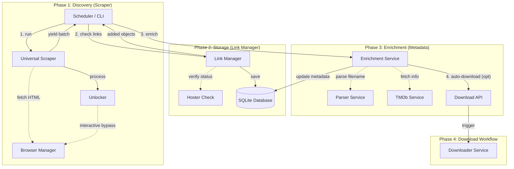
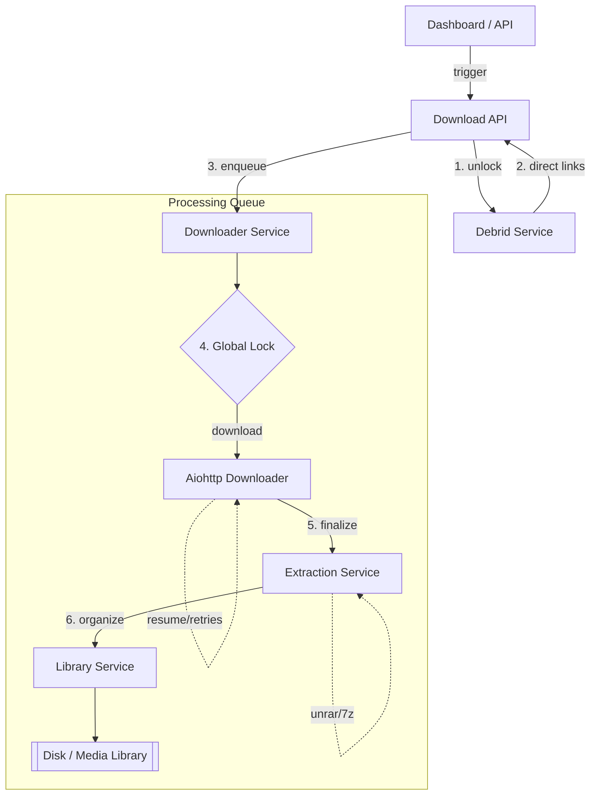

# DDLtower

> This project is a vibe coding project with Antigravity.

DDLtower is a automation tool for web link extraction, tagging and management.

## Features

- **Quick-Scan**: Instant URL extraction via headless browser.
- **Tagging**: Metadata fetching via **TMDb** with automatic translation for plots and posters.
- **Ratings**: Visual rating scale (1-10) integrated into the dashboard.
- **Stats Dashboard**: Complete overview of library volume and health.
- **Embedded Browser**: Dedicated Chromium instance via **Webtop** for manual navigation and Cloudflare bypass.
- **RSS**: Generate **RSS 2.0** feeds for both latest discovered releases and completed download history.

## Getting Started

```bash
git clone https://github.com/dmachard/ddltower.git
cd ddl-tower
mkdir data/
# Create .env file with your IDs
echo -e "UID=$(id -u)\nGID=$(id -g)\nDOCKER_GID=$(getent group docker | cut -d: -f3)\nNODE_NO_WARNINGS=1" > .env
docker compose up -d
```

- **Dashboard**: [http://localhost:8001](http://localhost:8001)  
- **Browser (Webtop)**: [http://localhost:8002](http://localhost:8002)
- **RSS Feed (Latest)**: [http://localhost:8001/api/rss](http://localhost:8001/api/rss) (Filters: `?category=movie`, `?category=series`, `?q=search`)  
- **RSS Feed (Movies Only)**: [http://localhost:8001/api/rss/movies](http://localhost:8001/api/rss/movies)  
- **RSS Feed (Series Only)**: [http://localhost:8001/api/rss/series](http://localhost:8001/api/rss/series)  
- **RSS Feed (Downloads)**: [http://localhost:8001/api/rss/downloads](http://localhost:8001/api/rss/downloads)

## Cloudflare Bypass (Turnstile)

To unlock links protected by Cloudflare Turnstile, DDLtower uses a remote-controlled browser within the `webtop` container.

### `socat` Installation

`socat` is required to bridge the network between the `ddltower` container and the browser.
Install it manually inside the container:
```bash
sudo docker exec -it ddltower-browser apt-get update
sudo docker exec -it ddltower-browser apt-get install -y socat
```

### Development environment

To launch the development environment:
```bash
docker compose -f docker-compose.dev.yml up -d
```

### Environment Variables (.env)

The `.env` file is used to manage permissions for the non-root user and allow access to the Docker socket:

- `UID`: Your local user ID (default: 1000)
- `GID`: Your local group ID (default: 1000)
- `DOCKER_GID`: The GID of the `docker` group on your host (needed for Link Unlocking).
- `NODE_NO_WARNINGS`: Suppress Node.js warnings (default: 1)

You can generate it automatically with:
```bash
echo -e "UID=$(id -u)\nGID=$(id -g)\nDOCKER_GID=$(getent group docker | cut -d: -f3)\nNODE_NO_WARNINGS=1" > .env
```

### Application Settings

Settings are managed in `config/config.yaml`.

## Maintenance CLI

DDLtower provides a unified command-line tool for administrative and maintenance tasks.

### Database Management (`db`)
Manage your library integrity and backups:
```bash
# Backup/Restore
sudo docker compose exec ddltower python3 -m app.cli.main db backup
sudo docker compose exec ddltower python3 -m app.cli.main db restore

# Manually rename or fix an entry by Title or ID
sudo docker compose exec ddltower python3 -m app.cli.main db update-title --title "Old Title" --new-title "New Title"
sudo docker compose exec ddltower python3 -m app.cli.main db update-title --id 123 --new-title "New Title"

# Clear scraping history (all or by pattern)
sudo docker compose exec ddltower python3 -m app.cli.main db reset-scans --pattern "example.com"

# Clear metadata for re-tagging (specific title)
sudo docker compose exec ddltower python3 -m app.cli.main db reset-metadata --title "Inception"

# WIPE ALL
sudo docker compose exec ddltower python3 -m app.cli.main db wipe

# Comprehensive cleanup and health audit
sudo docker compose exec ddltower python3 -m app.cli.main db cleanup
sudo docker compose exec ddltower python3 -m app.cli.main db audit
```

### Metadata Tagging (`tag`)
Match links with external metadata:
```bash
# [NEW] Simplified re-tagging (Rename + Search + Tag in one go)
sudo docker compose exec ddltower python3 -m app.cli.main tag --title "Old Title" --rename-to "New Title" --year 2024

# Batch tagging (unenriched links)
sudo docker compose exec ddltower python3 -m app.cli.main tag --limit 300

# Force specific match by title/year or IMDb ID
sudo docker compose exec ddltower python3 -m app.cli.main tag --title "Inception" --year 2010
sudo docker compose exec ddltower python3 -m app.cli.main tag --title "Deadpool" --id tt0439572

# Repair missing data (Missing posters, 404s, OR incorrectly grouped multi-part releases)
sudo docker compose exec ddltower python3 -m app.cli.main tag --repair
```

### Link Management (`links`)

```bash
# View detailed records for an item
sudo docker compose exec ddltower python3 -m app.cli.main links view "Deadpool"

# Re-verify all links currently marked as 'dead'
sudo docker compose exec ddltower python3 -m app.cli.main links reverify

# Re-tag a specific title
sudo docker compose exec ddltower python3 -m app.cli.main tag --title "CptinCurgos19770BuayFA20x6PTr%" --rename-to "Captains Courageous"  --year 1937

### Scraper Management (`scan`)
Trigger scraping manually:

```bash
sudo docker compose exec ddltower python3 -m app.cli.main scan
```

### Browser Management (`browser`)
Control the headless browser instance:
```bash
# Force a clean restart of the Chromium instance (useful if Cloudflare/Playwright hangs)
sudo docker compose exec ddltower curl -X POST http://localhost:8001/api/browser/restart
```

```bash
# Manually trigger a full scan of all configured sources (RSS & Crawl)
sudo docker compose exec ddltower python3 -m app.cli.main scan --source "MySource"
```

### Sqlite

```bash
sudo docker compose exec ddltower sqlite3 /app/data/ddl.db "SELECT official_title, poster_path, year FROM media_metadata WHERE imdb_id='tt32430579';"

sudo docker compose exec ddltower sqlite3 ./data/ddl.db "DELETE FROM download_links; DELETE FROM scraped_urls;"

```

## Universal Scraper

The Universal Scraper allows complex multi-step scraping (chaining) where results from one step serve as input for the next.

### Key Concepts
- **`follow_links: true`**: Explicitly tells the scraper to use extracted links as URLs for the next step.
- **`yield_links: true`**: Explicitly tells the scraper that extracted links are final results to be saved in the database.
- **`use_browser: true`**: Uses the headless Chromium instance (Webtop) to handle Javascript, wait for elements, or bypass protections.
- **`wait_for: 'selector'`**: Used with `use_browser: true`. Pauses the scraper until the specified CSS element (or text like `text=...`) appears on the page.
- **`wait_timeout: 30`**: (Optional) Time in seconds to wait for `wait_for` before timing out (default: 15s).
- **`wait_until: 'networkidle'`**: (Optional) Browser condition to wait for: `load`, `domcontentloaded`, `networkidle` (default: `domcontentloaded`).
- **`click_selector: 'selector'`**: Used with `use_browser: true`. Instructs the browser to click the specified CSS element before extracting the page content.
- **`js_code: |`**: Used with `use_browser: true`. Executes custom Javascript within the page to manually extract complex data. The code must return an array of dictionaries (e.g., `[{url: "...", title: "...", release: "..."}]`).
- **`scrape_once: true`**: Instructs the scraper to memorize the URL of this step in the database so it is never scraped again during future runs (prevents infinite loops on old articles).
- **`item_delay: 1.5`**: (Optional) Time in seconds to wait between processing individual items/links in a loop. Adds ±20% jitter for better stealth. (Default: 1s for RSS/Follow steps).
- **`ignore_resolutions: ["720p", "480p"]`**: (Optional) List of resolutions to ignore. If found in the item title or content, the item will be skipped.
- **`override_title: "{{ step_name.variable }}"`**: Forces the final media title using a variable extracted during a previous step (via `js_code` or `rss`). This title is treated as the **source of truth** and will prioritize over obfuscated filenames during metadata enrichment.
- **`override_year: "{{ step_name.variable }}"`**: Same as `override_title` but forces the release year.
- **`auto_download: true`**: (New) Automatically triggers the debrid-unlock and download workflow as soon as links are discovered and enriched. Perfect for full automation.
  - Can also accept a list of years, e.g., `auto_download: [2025, 2026]` to only download releases from specific years.
  - Alternatively, you can specify `auto_download_years: [2025, 2026]` at the same level as `auto_download: true` to restrict downloads by year for that specific step.
- **Global Settings** (in `config/config.yaml`):
  - **`auto_download_series_packs: false`**: (New) If set to `false`, prevents automatic download of series packs (full seasons). Default is `true`.
- **`debug: true`**: Saves the HTML content and a screenshot of the step in `/app/data/debug/` for troubleshooting.
- **`hoster_patterns`** (or `hoster_patterns_url`): Regex patterns to extract the final hoster links (e.g., 1fichier). If defined, the unlocker will exclusively search for these patterns on the unlocked page.
- **`dig_patterns`** (or `dig_patterns_url`): Regex patterns to extract intermediate links that must be navigated/dug into during the next step (e.g., rentry, idrix).
- **`ignore_patterns`**: List of regex patterns to explicitly ignore. If an extracted link matches one of these, it will be discarded (useful for filtering out tags, comments, or help pages).
- **`unlockers`** (Global config): Defines global rules for unlocking specific link protectors. Links matching any unlocker `patterns` are sent to the unlocker. You can configure `wait_for`, `click`, `extract_input`, and other actions to automate the unlocking process globally without writing code.
- **`unlock_patterns`**: (Optional) You can still define step-specific patterns that should be automatically sent to the LinkUnlocker. Any links matching these patterns (or the global unlocker patterns) are sent to the unlocker.
- **`type: "json"`**: Tells the scraper to parse the response as JSON (perfect for APIs).
- **`headers`**: Dictionary of custom HTTP headers to send with the request (e.g., `Accept`, `Origin`, `Authorization`).
- **`items_path: "$.path"`**: JSONPath expression to extract an array of items from the JSON response.
- **`filter: "$.results[?(@.id == {{ ... }})]"`**: JSONPath filter to match specific objects in the array.
- **`result_path: "$[0]"`**: Selects a specific element from the extracted/filtered list (e.g., to keep only the first result).
- **`pagination`**: Dictionary to handle paginated APIs. Contains `param` (the URL query parameter for the page), `max_pages` (limit), and `total_path` (JSONPath to find the total number of pages).
- **`{{ settings.VARIABLE }}`**: You can access any variable from `settings.py` or `.env` dynamically inside your URLs (e.g., `{{ settings.TMDB_API_KEY }}`).

### Configuration Example

```yaml
# --- Global Unlockers ---
unlockers:
  - name: "Zoneurs"
    patterns:
      - 'https?://zoneurs\.net/.*'
    wait_for: "#unlockBtn"
    click: "#unlockBtn"
    wait_result: ".result-input"
    extract_input: true

sources:
  - name: "MyComplexSource"
    is_chain: true
    steps:
      - name: "index"
        url: "https://example.com/index"
        type: "html"
        follow_links: true
        dig_patterns_url:
          - 'https?://example\.com/post/[\w-]+'

      - name: "post_page"
        url: "{{ index }}"
        use_browser: true
        wait_for: ".download-button"
        debug: true  # Saves screenshot & HTML to data/debug/
        yield_links: true
        hoster_patterns_url:
          - 'href=["''](https?://(?:www\.)?1fichier\.com/\?[\w-]+)[^"'']*["'']'
```

### Context Variables (Templating)

When a step extracts links and passes them to the next step, it transfers an entire dictionary of attributes. These attributes are accessible in the next step using `{{ step_name.attribute }}`.

The structure of this dictionary depends on how the links were extracted:
- **`js_code`**: Transfers exactly the dictionary returned by the Javascript code (e.g., `{"url": "...", "title": "..."}`).
- **`type: "json"` (`items_path`)**: Transfers the exact JSON object extracted from the API (e.g., `{"id": 123, "title": "...", "release_date": "2024-01-01"}`).
- **`type: "rss"`**: Transfers standard RSS item fields (e.g., `{"link": "...", "title": "...", "published": "..."}`).
- **`type: "html"` (Regex `dig_patterns` / `regex_patterns`)**: Transfers a minimal dictionary containing only the URL: `{"url": "the_matched_url"}`.

*Note: For steps that only extract URLs (like regex), you can use `{{ step_name.url }}` or simply `{{ step_name }}` to inject the URL into the next step.*


### Debugging Config

- **Visual Inspection**:
   Open `http://localhost:8002` to see the browser in action.
- **Debug Files**:
   Check `./data/debug/` for screenshots and HTML dumps generated via `debug: true`.


## alternative scrape

- https://github.com/omkarcloud/botasaurus
- https://github.com/D4Vinci/Scrapling


## Architecture

1. Scraping & Enrichment Engine



2. Download & Library Workflow



## Tests

```bash
docker compose exec -T ddltower python3 -m pytest -p no:cacheprovider -v app/tests/test*
```