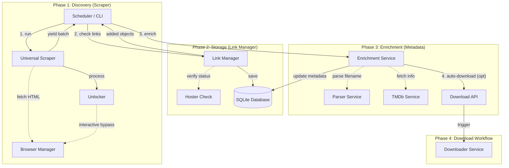
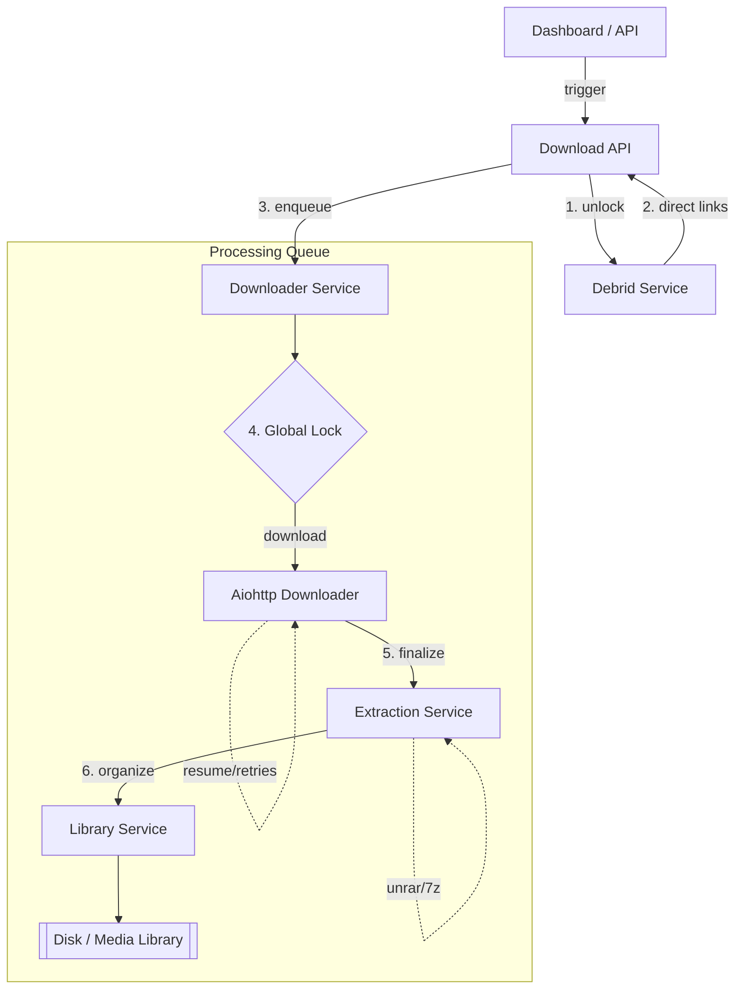

# Architecture

## 1. Scraping & Enrichment Engine

```mermaid
graph TD
    SCH[Scheduler / CLI]
    
    subgraph "Phase 1: Discovery (Scraper)"
        SCH -->|1. run| SCR[Universal Scraper]
        SCR -.->|fetch HTML| BRW[Browser Manager]
        SCR -->|process| UNL[Unlocker]
        UNL -.->|interactive bypass| BRW
        SCR -- "yield batch" --> SCH
    end

    subgraph "Phase 2: Storage (Link Manager)"
        SCH -- "2. check links" --> LNK[Link Manager]
        LNK -.->|verify status| HST[Hoster Check]
        LNK -- "save" --> DB[(SQLite Database)]
        LNK -- "added objects" --> SCH
    end

    subgraph "Phase 3: Enrichment (Metadata)"
        SCH -- "3. enrich" --> ENR[Enrichment Service]
        ENR -.->|parse filename| PRS[Parser Service]
        ENR -.->|fetch info| TMDB[TMDb Service]
        ENR -- "update metadata" --> DB
        ENR -- "4. auto-download (opt)" --> API
    end

    subgraph "Phase 4: Download Workflow"
        API[Download API] -->|trigger| DL[Downloader Service]
    end
```

## 2. Download & Library Workflow

```mermaid
graph TD
    UI[Dashboard / API] -->|trigger| API[Download API]
    API -->|1. unlock| DEB[Debrid Service]
    DEB -->|2. direct links| API
    API -->|3. enqueue| DL[Downloader Service]
    
    subgraph "Processing Queue"
        DL --> LOCK{4. Global Lock}
        LOCK -->|download| GET[Aiohttp Downloader]
        GET -.->|resume/retries| GET
        GET -->|5. finalize| EXT[Extraction Service]
        EXT -.->|unrar/7z| EXT
        EXT -->|6. organize| LIB[Library Service]
        LIB --> DISK[[Disk / Media Library]]
    end
```
